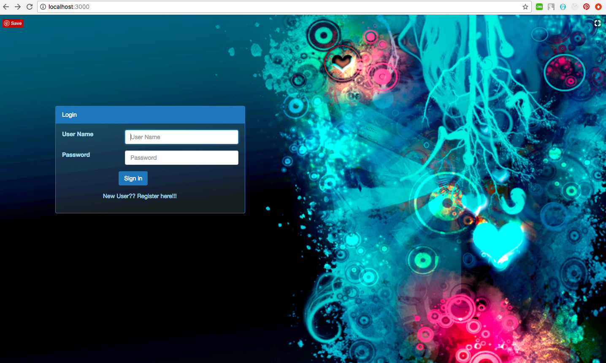
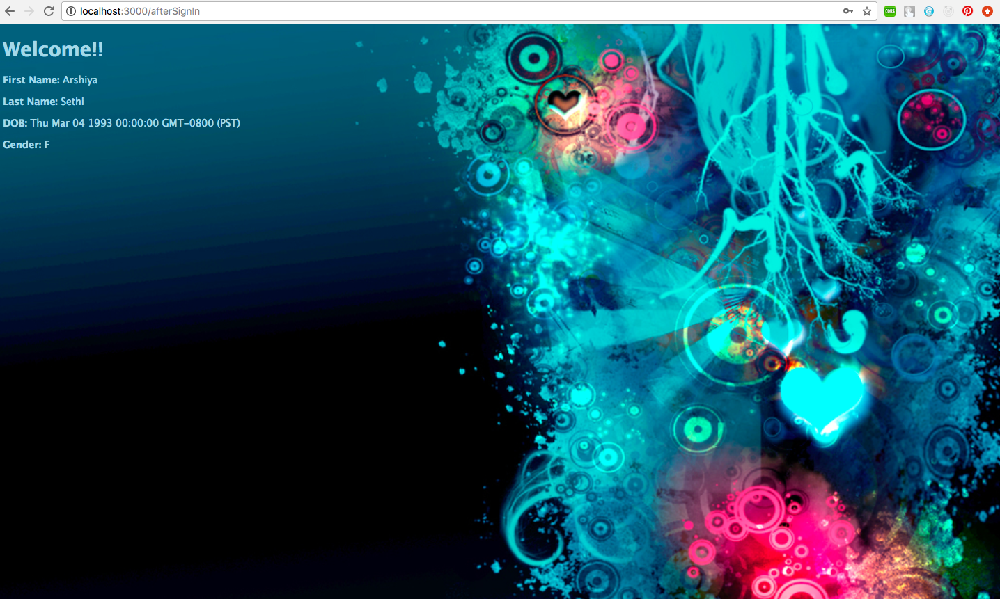
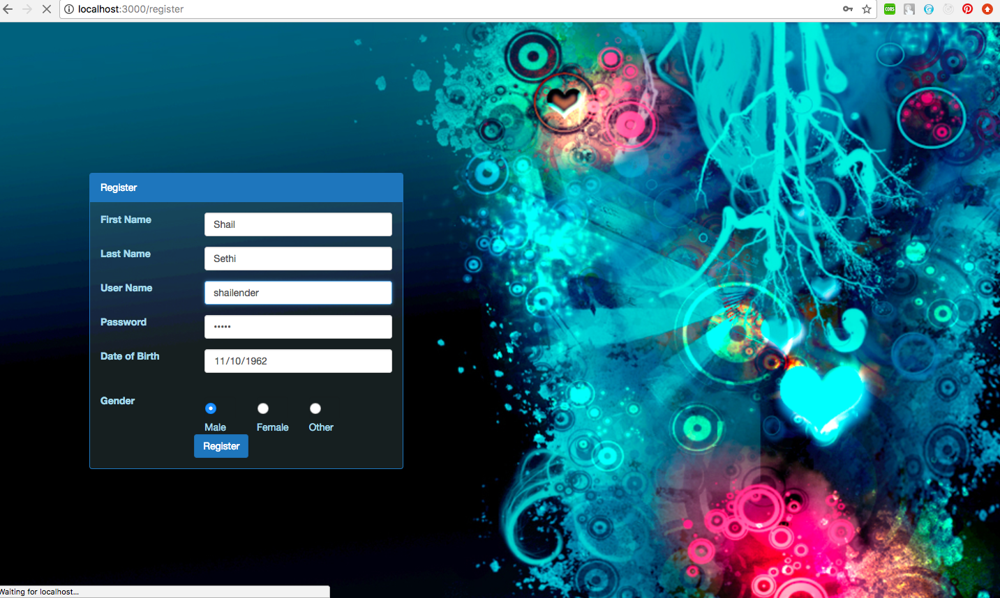
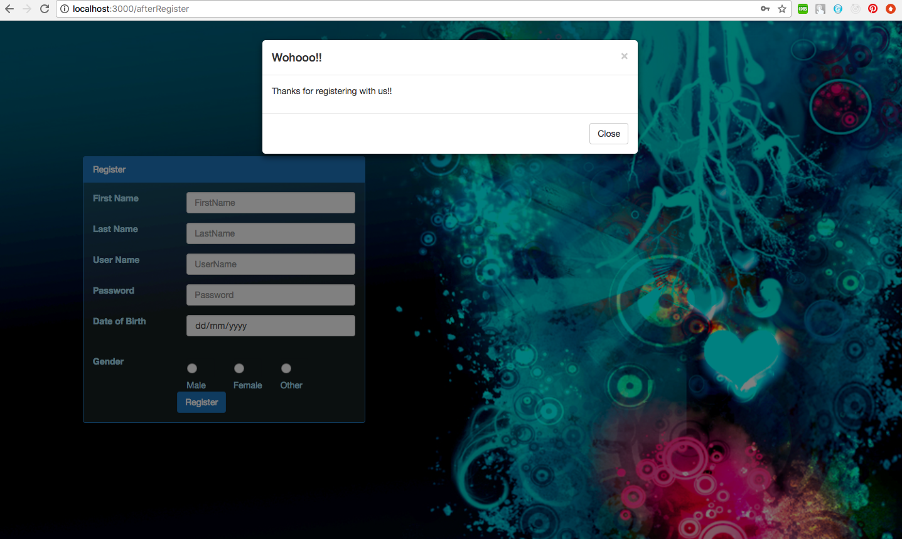

# Login_demo

Login page using technologies:

• Frontend: ejs  
• Backend:  node.js
• Database: MySQL

Features: 

• Login 
• Register

Steps to run the application:
1. Import the project in Eclipse
2. Right click and Run as -> npm install
3. Right click and Run as -> Node.js Application

Below are some screenshots demonstrating the application:

### Welcome Page

### Login

### Login Successful

### Register

### Register Successful

